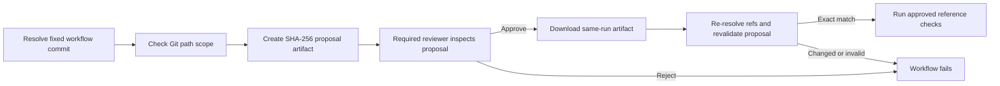

# Human-approved agent workflow

The reference workflow separates an agent proposal from any post-approval
execution. Validation can run automatically, but the second job cannot start
until a configured GitHub Environment reviewer approves it.



The implementation is
[`human-approved-agent.yml`](../.github/workflows/human-approved-agent.yml).
It uses the GitHub Environment named `agent-approval`.

## Mandatory environment setup

The workflow deliberately fails in its validation job unless the environment:

- is named `agent-approval`;
- has at least one required reviewer;
- uses custom deployment branch policies.

Create the environment in **Settings → Environments**, add the responsible
user or team under **Required reviewers**, and restrict deployment branches to
`main`. For a team repository, enable **Prevent self-review** and use a reviewer
who is different from the workflow initiator.

The equivalent REST configuration is:

```json
{
  "wait_timer": 0,
  "prevent_self_review": true,
  "reviewers": [
    {
      "type": "User",
      "id": 123456
    }
  ],
  "deployment_branch_policy": {
    "protected_branches": false,
    "custom_branch_policies": true
  }
}
```

Reviewer IDs are GitHub numeric IDs, not usernames. After creating the
environment, create a custom deployment branch policy whose name is `main`.
See GitHub's official
[environment API](https://docs.github.com/en/rest/deployments/environments)
and
[deployment branch policy API](https://docs.github.com/en/rest/deployments/branch-policies).

Do not copy the placeholder reviewer ID. Do not put credentials in the policy,
workflow, proposal artifact, or repository.

## Run it

The workflow is manual-only. Run it from the Actions tab on the `main` branch,
or with GitHub CLI:

```bash
gh workflow run human-approved-agent.yml \
  --ref main \
  -f base_ref=HEAD^ \
  -f policy=examples/approval-gate/policy.json
```

The first job resolves the dispatched `github.sha`, evaluates `base_ref...sha`,
and uploads `agent-proposal-RUN_ID`. Review the job summary and proposal
artifact. GitHub then places the second job in a waiting state.

Approve or reject the deployment from the workflow run's **Review
deployments** dialog. GitHub documents the exact interaction in
[Reviewing deployments](https://docs.github.com/en/actions/how-tos/deploy/configure-and-manage-deployments/review-deployments).
An automated agent should never approve its own pending deployment through the
user's token.

## What the proposal binds

The JSON artifact records:

- the policy path;
- the requested base revision and its resolved commit;
- the fixed workflow head revision and commit;
- every changed path;
- the successful scope result;
- a SHA-256 digest over the canonical proposal.

After approval, a fresh job downloads only the artifact named for the current
workflow run, checks its digest, resolves the refs again, recomputes the Git
diff, and reapplies the policy. Any mismatch rejects execution.

GitHub's official `upload-artifact` v4-and-newer implementation creates
immutable artifacts. The workflow pins current official action releases to
full commit SHAs instead of floating major-version tags.

## Security boundary

- Only `workflow_dispatch` can start the workflow.
- `pull_request_target` is not used.
- The workflow token has only `actions: read` and `contents: read`.
- Checkout credentials are not persisted.
- Shell commands receive inputs through quoted environment variables.
- The head commit comes from `github.sha`, not a moving user-supplied branch.
- No arbitrary command, script, secret, environment secret, or write permission
  is accepted as workflow input.
- The reference execution runs repository tests and syntax compilation only.

To adapt the final job for publishing or deployment, grant only the exact
permission required at that job, store secrets in the protected environment,
and preserve proposal revalidation before the first mutation.

## Limitations

- Environment rules live in GitHub settings, outside the Git tree. The
  preflight check detects missing reviewers or an open branch policy, but an
  administrator can still change settings later.
- SHA-256 detects proposal changes; it is not a cryptographic identity
  signature or CI attestation.
- A solo repository may need to allow the initiating user to approve their own
  run. This gives an explicit human pause but not separation of duties.
- The checked-in workflow demonstrates the gate with safe tests. It does not
  deploy software or run an autonomous coding agent.
- Pinned official Action commits must be reviewed and updated deliberately as
  supported releases change.

GitHub explains that jobs referencing an environment with required reviewers
wait before starting, and recommends minimum `GITHUB_TOKEN` permissions in its
[deployment environment](https://docs.github.com/en/actions/reference/workflows-and-actions/deployments-and-environments)
and
[workflow syntax](https://docs.github.com/en/actions/reference/workflows-and-actions/workflow-syntax)
documentation.
